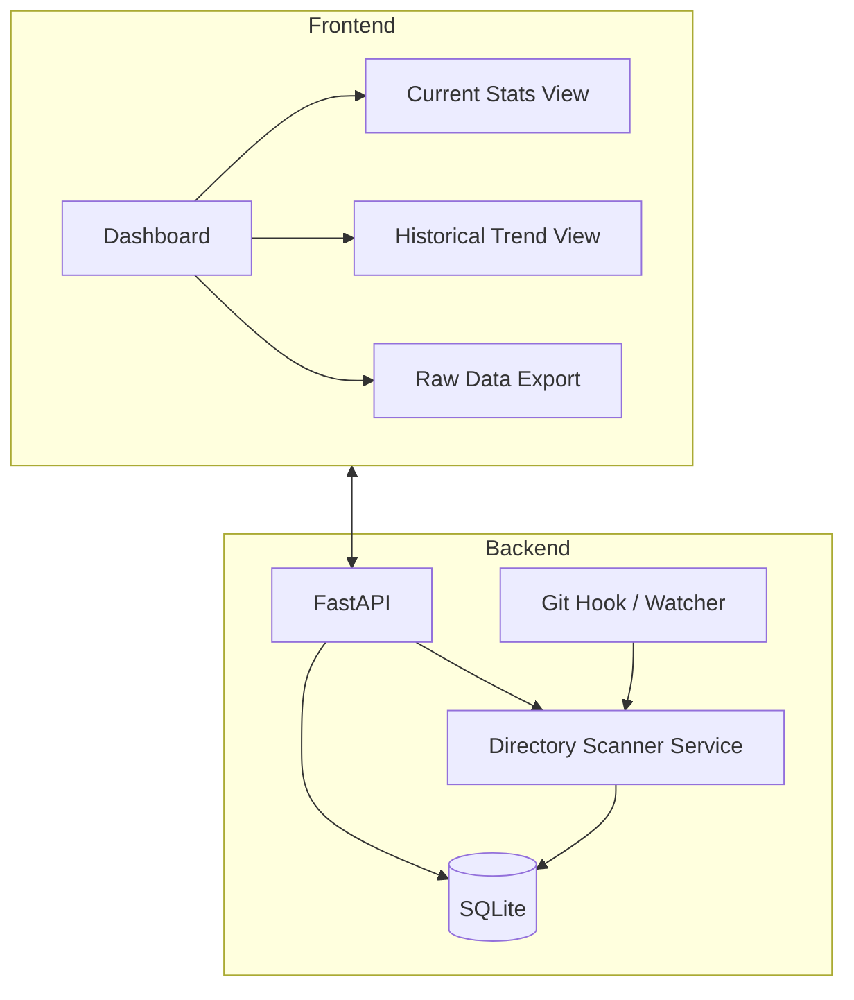

# PySizer — Spec Sheet

## 1. Overview

PySizer is a local-first desktop/web app that scans software project directories on disk, calculates their storage footprint, breaks that footprint down by language/file type, and tracks how it changes over time. It's a "disk usage + project health" dashboard aimed at developers who juggle a lot of local repos (sound familiar).

**Non-goals for v1:** cloud sync, multi-user auth, remote directory scanning, duplicate-file detection (flagged as a stretch goal, not core).

## 2. Core Functionality

### 2.1 Directory Analysis
- Recursive directory traversal to compute total size, file count, and per-extension breakdown for a given project root.
- Depth-limited traversal with sane defaults to avoid pathological scans (e.g. `node_modules`-style trees).
- Extension-to-language mapping so results can be grouped as "Python: 4.2 MB across 38 files" rather than raw extensions.

### 2.2 Historical Tracking
- Each scan of a project produces a timestamped snapshot (total size, per-language breakdown, file count).
- Snapshots are diffed against the previous one to compute size delta.
- Snapshots can optionally be triggered by new Git commits in a watched repo, in addition to manual/scheduled scans.

### 2.3 Visualization
- **Pie chart** — language/extension distribution for the current snapshot.
- **Bar chart** — size comparison across multiple tracked projects.
- **Timeline** — historical size trend for a single project across snapshots.
- **Raw data export** — JSON (and optionally CSV) dump of any project's snapshot history.

## 3. Architecture

Scans run **locally against the filesystem** — this is not a zip-and-upload model. The backend has direct `pathlib` access to the paths it's given, which keeps things fast and avoids the size/complexity of packaging directories for transport.



**Stack:**
- **Backend:** FastAPI + SQLAlchemy + SQLite (matches your standard stack)
- **Frontend:** React + Vite + TypeScript + Tailwind, Recharts or Chart.js for visualization
- **Desktop wrapper (optional, later):** Tauri, if you want this off the browser and onto the desktop like your other local tools

## 4. Data Model

```sql
CREATE TABLE projects (
    id INTEGER PRIMARY KEY,
    name TEXT UNIQUE NOT NULL,
    root_path TEXT NOT NULL,
    created_at TIMESTAMP DEFAULT CURRENT_TIMESTAMP
);

CREATE TABLE snapshots (
    id INTEGER PRIMARY KEY,
    project_id INTEGER NOT NULL,
    taken_at TIMESTAMP DEFAULT CURRENT_TIMESTAMP,
    total_size_bytes INTEGER NOT NULL,
    file_count INTEGER NOT NULL,
    language_distribution JSON NOT NULL,   -- {"py": {"bytes": ..., "files": ...}, ...}
    size_delta_bytes INTEGER,              -- vs. previous snapshot, nullable for first scan
    trigger TEXT NOT NULL DEFAULT 'manual', -- 'manual' | 'scheduled' | 'git_commit'
    FOREIGN KEY (project_id) REFERENCES projects(id)
);
```

`language_distribution` is stored as JSON rather than a separate normalized table — it's write-once, read-mostly, and querying across languages isn't a first-class use case, so normalization isn't worth the join overhead here.

## 5. API Surface (v1)

| Method | Path | Purpose |
|---|---|---|
| POST | `/projects/` | Register a new project (name + root path) |
| GET | `/projects/` | List tracked projects |
| GET | `/projects/{id}` | Get project details + latest snapshot |
| POST | `/projects/{id}/scan` | Trigger a manual scan/snapshot |
| GET | `/projects/{id}/snapshots` | Get snapshot history for a project |
| GET | `/projects/{id}/export` | Export snapshot history as JSON/CSV |
| DELETE | `/projects/{id}` | Stop tracking a project |

## 6. Security & Safety Considerations

- **Path validation:** registered root paths must be validated to exist and be readable before being stored; reject symlink loops.
- **Extension whitelist** is used only for *language classification*, not for restricting what gets scanned — every file counts toward total size regardless of type.
- **Permission errors** during traversal (locked files, restricted dirs) are caught per-file/per-directory and logged as scan warnings, not fatal errors — the scan should complete with partial data rather than aborting.
- No remote code execution or arbitrary path traversal from user input — root paths come from an explicit, user-approved registration step, not free-form request parameters.

## 7. Performance Considerations

- Traversal uses `pathlib` + `os.scandir` (faster than repeated `stat()` calls) rather than `shutil.disk_usage`, which reports filesystem/volume usage, not directory-tree usage — the original prompt conflated these; they are not interchangeable.
- Large projects (500+ MB): traversal runs as an async background task, with the API returning a scan-in-progress status rather than blocking the request.
- Configurable depth/size limits to avoid runaway scans into things like `node_modules`, `.venv`, or `.git` internals (these should be excluded by default, not just soft-limited).

## 8. Future Enhancements (out of scope for v1)
- Duplicate file detection across tracked projects (hash-based)
- Git commit-linked automatic snapshots
- Tauri desktop packaging
- Cloud backup/sync of the SQLite DB (Dropbox/Drive)
